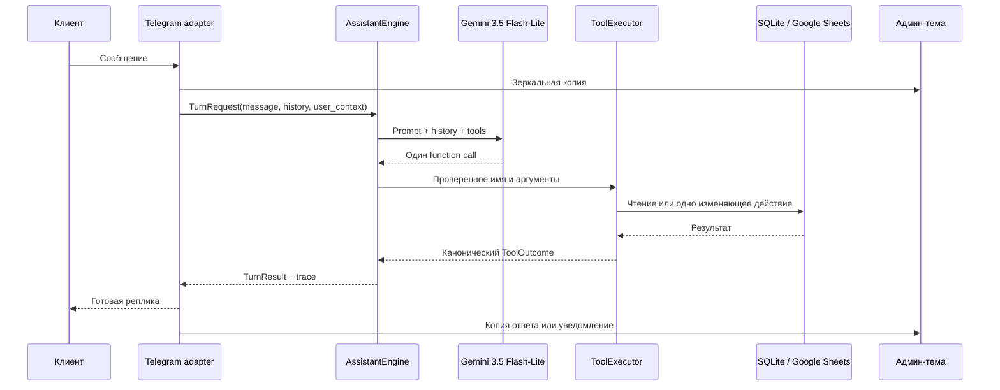

# PRD: виртуальный Telegram-ассистент EduJobs

Версия: 2.0
Статус: реализованный MVP
Дата актуализации: 29 августа 2026 года

## 1. Концепция продукта

### Цель

Снять с администратора Telegram-канала рутинное первичное общение с
рекламодателями: автоматически отвечать на FAQ, помогать с датами и
бронированием, собирать запросы на документы и передавать менеджеру случаи,
которые требуют человека.

### Главная ценность

- мгновенные ответы 24/7 без кнопочных меню;
- единые и проверяемые бизнес-формулировки;
- отсутствие потерянных лидов;
- прозрачная передача диалога менеджеру;
- возможность локально тестировать диалоги без Telegram и без внешних записей.

## 2. Пользовательские роли

- **Рекламодатель (клиент):** компания, ИП или самозанятый, заказывающий
  рекламу либо размещающий вакансию.
- **Представитель клиента:** менеджер, бухгалтер или руководитель, который
  пишет боту от лица клиента.
- **Администратор:** владелец канала или менеджер, который согласовывает
  нестандартные вопросы, оплату, публикации и креативы.

## 3. Пользовательские пути

### 3.1 Представитель клиента

1. Пишет боту обычным текстом, без меню.
2. Получает канонические ответы о рекламе, вакансиях, форматах, статистике,
   документах и правилах размещения.
3. Запрашивает свободные даты или проверяет конкретные даты.
4. Перед бронированием сообщает рекламную тематику и выбранную дату.
5. При запросе счёта, договора или акта передаёт название компании/ФИО и ИНН;
   если данных не хватает, бот запрашивает только недостающее.
6. Может прислать материалы и медиа — они пересылаются в админ-тему.
7. При оплате, прямом запросе менеджера, взаимопиаре, операции с уже
   опубликованным постом или нестандартной ситуации диалог передаётся человеку.

### 3.2 Администратор

1. Работает в закрытой Telegram-супергруппе с forum topics.
2. Видит отдельную тему для каждого представителя и зеркальную историю
   общения клиента с ботом.
3. Получает категоризированные эскалации и служебные уведомления о документах.
4. Пишет ответ прямо в тему; бот доставляет его клиенту и переходит в режим
   ручного диалога.
5. Завершает ручной режим командой `/close`, после чего автоматические ответы
   возобновляются.

## 4. Функциональные требования

### 4.1 FAQ и маршрутизация

- Все смысловые сообщения направляются в `gemini-3.5-flash-lite`.
- Семантические регулярные выражения не используются.
- `/start`, `/help` и медиа без подписи являются транспортными событиями и
  обрабатываются Telegram-адаптером без LLM; весь обычный текст идёт в модель.
- Модель обязана вызвать ровно один зарегистрированный tool и не имеет канала
  для свободного ответа клиенту.
- Благодарность обрабатывается tool `reply_gratitude`; благодарность перед
  реальным вопросом не должна скрывать вопрос.
- Несколько информационных вопросов объединяются одним
  `answer_information`.
- Несколько независимых изменяющих действий в одном сообщении не выполняются:
  бот вызывает `handover_to_admin`.

### 4.2 Канонические ответы

- Цены, условия, ссылки и handover-формулировки хранятся в `bot/replies.py`.
- Результат tool является готовой клиентской репликой; второго LLM-вызова для
  перефразирования нет.
- Свободный текст модели без function call считается ошибкой маршрутизации и
  не отправляется клиенту.

### 4.3 Календарь и бронирование

- Google Sheets — источник правды по рекламным слотам.
- Без указанного месяца показываются пять ближайших свободных дат.
- Для названного месяца показываются доступные даты в допустимом окне.
- Можно проверить одну или несколько конкретных дат.
- Бронирование требует известной рекламной тематики и даты.
- Перед записью статус слота проверяется повторно.
- Запрещённые рекламные тематики передаются менеджеру.

### 4.4 Документы

- Бот различает информационный вопрос о документах и фактический запрос на
  подготовку документа.
- Задача создаётся только при наличии компании/ФИО и корректного ИНН.
- Недостающие реквизиты могут быть получены из следующего сообщения благодаря
  истории диалога.
- После создания задачи менеджер получает служебное уведомление, но бот не
  останавливает автоматический диалог.

### 4.5 Публикации и эскалации

- Поддерживаются запросы на статус, исправление, удаление, ускорение,
  преобразование в платное размещение, сообщение о неработающей форме и статус
  согласования рекламной темы.
- Tool собирает обязательные данные перед созданием эскалации.
- При handover клиентская тема получает `waiting_human`; после ответа
  менеджера — `human_mode`.

## 5. Архитектура

### 5.1 Компоненты

1. **Telegram adapter (`bot/handlers.py`)**
   - long polling через aiogram;
   - rate limit, ограничения длины и обработка медиа;
   - создание и ведение forum topics;
   - хранение истории и преобразование Telegram update в `TurnRequest`.
2. **Assistant core (`assistant/engine.py`)**
   - не зависит от Telegram;
   - делает один модельный вызов;
   - валидирует решение до выполнения side effect;
   - возвращает типизированный `TurnResult` и trace-метрики.
3. **Gemini router (`llm/gemini_client.py`)**
   - единственная модель `gemini-3.5-flash-lite`;
   - native function calling в режиме обязательного вызова функции;
   - один tool call на ход.
4. **Tool executor (`llm/tool_executor.py`)**
   - registry разрешённых функций;
   - проверка аргументов;
   - принудительная подстановка доверенного `telegram_id`, контакта и ссылки;
   - production- и dry-run-исполнение.
5. **Хранилища и интеграции**
   - SQLite для пользователей, тем, состояния и истории;
   - Google Sheets для календаря и задач по документам;
   - Telegram forum topics как интерфейс менеджера.

LangChain, LangGraph, модельный каскад и резервный LLM-провайдер в MVP не
используются.

### 5.2 Поток одного сообщения



## 6. Состояния диалога

| Состояние | Поведение |
|---|---|
| `active` | Бот отвечает автоматически |
| `waiting_human` | Менеджер вызван; новые сообщения зеркалируются, клиенту сообщается, что менеджер уже в пути |
| `human_mode` | Бот молчит, сообщения между клиентом и менеджером пересылаются через тему |

## 7. Безопасность

- Сессии и история изолированы по реальному Telegram ID.
- Telegram ID и служебные ссылки нельзя подменить через prompt injection.
- Tool вне allowlist не исполняется.
- Некорректные аргументы отклоняются до side effect.
- Пользовательские значения экранируются от Google Sheets formula injection.
- `.env` и service-account JSON не входят в Git и Docker build context.
- Production-контейнер непривилегированный, read-only и без Linux
  capabilities.

## 8. Ошибки и конкурентность

- LLM-вызов ограничен `GEMINI_TIMEOUT`; timeout превращается в безопасную
  ошибку/передачу менеджеру.
- Необработанная Gemini API ошибка не раскрывается клиенту: он получает
  техническую заглушку, а ошибка записывается в лог и админ-тему.
- Google Sheets ошибки превращаются в канонический ответ об ошибке интеграции.
- Сообщения одного пользователя обрабатываются последовательно под lock.
- Бронирование повторно проверяет доступность непосредственно перед записью.

## 9. Локальное тестирование и критерии приёмки

### Автоматические проверки

- `python -m unittest discover -s tests` должен завершаться без ошибок.
- `python -m compileall -q assistant bot llm scripts tests` должен завершаться
  без ошибок.
- `docker compose config --quiet` должен подтверждать валидность compose.

### Eval

```bash
python scripts/eval_assistant.py \
  --dataset tests/fixtures/dialog_cases.jsonl \
  --metrics
```

Минимальные критерии для текущего датасета:

- route accuracy с учётом явно разрешённых эквивалентных tools — не ниже 95%;
- ручная приёмка ответов с оценкой 4–5 — не ниже 95%;
- errors — 0;
- каждый ход содержит ровно одну модель в `model_path`;
- side effects отключены через `DryRunToolExecutor`;
- сложный запрос с несколькими изменяющими действиями приводит к
  `handover_to_admin`.

Baseline от 29 августа 2026 года: 65 диалоговых кейсов, 73 хода, из них 55
обезличенных реальных диалогов. Строго прошло 71/73 (97,26%), ошибок нет;
вручную проверено 73/73, принято 70/73 (95,89%), средняя оценка 4,89/5.
Mean latency 765 мс, p50 731 мс, p95 1 088 мс, max 1 283 мс,
403 284 токена.

## 10. Вне текущего MVP

- автоматический fallback на другую модель или провайдера;
- LangChain/LangGraph;
- генерация свободных клиентских ответов моделью;
- хранение медиа в базе;
- полноценная CRM вместо SQLite и Google Sheets.
