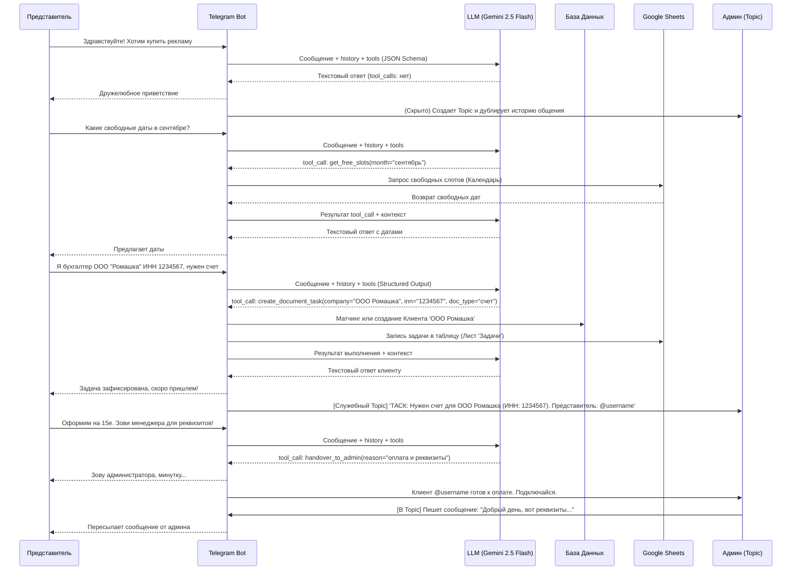

# Техническое задание (ТЗ) и Архитектура: Виртуальный Telegram-ассистент для продажи рекламы

## 1. Концепция продукта
**Цель:** Снять с администратора Telegram-канала рутину по первичному общению с рекламодателями, автоматизировать ответы на частые вопросы (FAQ), процесс бронирования дат и сбор креативов.
**Главная ценность:** Экономия времени админа и отсутствие потерянных лидов за счет мгновенных ответов 24/7 с сохранением "человеческого" лица (без кнопочных меню).

## 2. Пользовательские роли

*   **Рекламодатель (Клиент):** Юридическое лицо или ИП, заказывающее рекламу.
*   **Представитель клиента:** Физическое лицо (менеджер, бухгалтер, руководитель), общающееся с ботом от лица Клиента. У одного Клиента может быть несколько представителей.
*   **Администратор (Владелец канала):** Принимает решения, согласовывает креативы, отправляет платежные реквизиты, контролирует процесс.

## 3. Пользовательские пути (User Flows)

### 3.1 Путь Представителя клиента (Advertiser Flow)
1.  **Старт:** Пользователь пишет боту. Бот приветствует его в дружелюбном тоне, имитируя живого помощника. Никаких меню с кнопками.
2.  **Консультация:** Бот отвечает на вопросы о стоимости, условиях (например, "сколько пост держится в топе"), статистике канала, опираясь на заложенную базу знаний.
3.  **Бронирование и Идентификация:** 
    *   Если клиент выражает серьезное намерение, бот запрашивает желаемые даты.
    *   Бот сверяется с Google Таблицей (Календарем) и предлагает свободные слоты либо подтверждает выбранные.
    *   **Мягкий запрос ИНН:** Бот запрашивает юридические данные компании (ИНН и название) *только* на этапе фактического бронирования или запроса документов, и *только* если этих данных еще нет в БД бота (то есть пользователь пишет нам впервые). На этапе обычной консультации по ценам или статистике бот не должен требовать от клиента никаких данных.
4.  **Сбор материалов:** 
    *   Бот принимает текстовые материалы и медиа-вложения (визуал) для поста. Никаких проверок контента от бота не требуется. Тексты и вложения пересылаются в админскую группу.
5.  **Документооборот (опционально):**
    *   Если представитель клиента (например, бухгалтер) запрашивает договор, счет или акт, бот фиксирует этот запрос.
    *   **Матчинг представителей:** Если пишет новый представитель (например, бухгалтер) и называет ИНН или название компании, бот находит сущность Клиента в базе и привязывает этого пользователя к единому профилю Клиента.
    *   Бот информирует представителя о статусе подготовки документов.
6.  **Переход на администратора (Handover):**
    *   На этапе оплаты бот зовет администратора канала для выставления реквизитов.
    *   При прямом запросе ("позови менеджера/человека") бот приостанавливает автоматическое общение и передает диалог админу.

### 3.2 Путь Администратора (Admin Flow)
1.  **Рабочий интерфейс (Telegram Форум):**
    *   Управление происходит в закрытой Telegram-группе с включенными темами (Форумом).
    *   Каждая тема (Topic) представляет собой диалог с одним представителем клиента.
    *   Бэкенд понимает, какие представители (темы) относятся к одному Клиенту, и предоставляет админу контекст.
2.  **Управление датами:**
    *   Администратор ведет сетку занятых слотов в едином документе — **Google Таблице**. Бот читает из неё данные для предоставления клиентам и может вносить предварительные брони (по согласованию бизнес-логики).
3.  **Управление документами (Task Tracker):**
    *   При запросе документов от клиента бот автоматически создает тикет-задачу: добавляет новую строку в рабочую Google Таблицу (на отдельный лист) и присылает уведомление в служебную тему в Telegram-группе.
4.  **Подхват диалога и модерация:**
    *   Администратор читает переписку бота с клиентом прямо в соответствующей теме.
    *   При необходимости (оплата, сложный вопрос) админ пишет сообщение в эту тему, и бот пересылает его представителю клиента.

## 4. Конфиденциальность и безопасность
*   **Изоляция сессий:** Бот ведет обособленный диалог с каждым представителем.
*   **Права в админ-группе:** В рабочую группу добавлены только нужные люди. Бот не обрабатывает команды от неавторизованных пользователей внутри этой группы.
*   **Хранение данных:** База данных надежно хранит связи связок "ИНН/Название Клиента" <-> "Telegram ID представителей", чтобы не допускать утечек документации не тем контактным лицам.

## 5. Верхнеуровневая архитектура

Для реализации потребуется разработать бэкенд, который будет объединять все API.

### 5.1 Основные компоненты системы:

1.  **Telegram Bot Gateway:** Микросервис для получения Webhooks от Telegram API.
2.  **LLM Core (Ядро диалога):** 
    *   Интеграция с LLM через **самописную логику агента на Python** — прямые вызовы API. Без LangChain и аналогичных фреймворков.
    *   **Основная модель (MVP):** Google Gemini 2.5 Flash. Предусмотрена резервная модель (Fallback) — OpenAI GPT-5.4 mini. Переключение между провайдерами должно быть реализовано через параметр конфигурации (например, в файле .env).
    *   Системный промпт для LLM определяет тон общения ("дружелюбно") и форматы ответов.
    *   **Нативный Tool Calling (Function Calling):** Для распознавания намерений и выполнения действий используется встроенный механизм Tool Calling API. Бэкенд описывает доступные функции (tools) в JSON-схеме (например, `get_free_slots`, `create_document_task`, `handover_to_admin`), а LLM возвращает структурированный вызов нужной функции с параметрами. Это исключает ненадёжный парсинг свободного текста и даёт полный контроль: бэкенд сам решает, выполнять ли вызов.
    *   **Structured Output:** Для извлечения сущностей (ИНН, название компании, тип документа) используется Structured Output (response_format c JSON Schema), что гарантирует предсказуемый формат ответа от LLM.
3.  **Bot Backend Logic (Бизнес-логика) и Память (Context Management):**
    *   **Управление памятью:** Сохраняет историю переписки в базу данных (SQLite) и передает весь диалог в LLM для понимания контекста.
    *   Управляет состояниями диалогов конечных пользователей (State Machine).
    *   Выполняет алгоритм связывания (матчинга) представителей по ИНН/названию.
    *   Транслирует сообщения между личными чатами с ботом и topic'ами (темами) в админской группе.
4.  **База Данных (SQLite):**
    *   Таблицы: `Clients`, `Representatives` (пользователи TG), `AdminTopics` (связь топиков с пользователями).
5.  **Google Sheets Integrator (через Google API):**
    *   Чтение календаря слотов (Дата | Клиент | Сумма | Срок размещения) для планирования публикаций.
    *   Запись тасок по документам (кто запросил, ИНН, тип документа) на отдельный лист.

### 5.2 Диаграмма взаимодействия (Sequence Diagram)

## 6. Обработка ошибок и Конкурентность (Race Conditions)
*   **Race Conditions при бронировании:** Бот использует оптимистичную блокировку. Перед фактической записью в Google Таблицу проверяется, что дата всё ещё свободна. Если занята — бот предлагает новые даты.
*   **Отказоустойчивость API:**
    *   **LLM (Gemini):** При 500-х и сетевых ошибках бот делает несколько попыток отправок (Retry).
    *   **Google Sheets:** При достижении лимитов запросов (429 Too Many Requests) используется экспоненциальная задержка (Exponential Backoff).
*   **Глобальный перехват ошибок:** Любое необработанное исключение (Exception) приводит к автоматическому уведомлению в Topic администратора с текстом ошибки (Traceback), а клиент получает вежливое сообщение-заглушку с извинениями.
